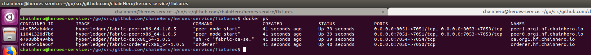

# How to build an hyperledger-fabric network ?

This tutorial will introduce you to the Hyperledger Fabric network and will allow you to build your own Hyperledger Fabric network.

It is working on **Ubuntu 16.04** with **Hyperledger-Fabric version 1.0.5**.

For convenience only, we will create the network we used in our main [tutorial](https://chainhero.io/2018/03/tutorial-build-blockchain-app-2/).

## 1. Installation Guide

### a. Prepare environment

Before doing anything let's create our working directory :

```bash
mkdir -p $GOPATH/src/github.com/chainHero/heroes-service-network
```

### b. Dependencies

In order for us to correctly create our network we need few binaries provided by Hyperledger Fabric (v1.0.5).

You can either use the binaries we provide or download them from the official repository. 

#### Download them from our repository (Linux x64 ONLY):

```bash
cd $GOPATH/src/github.com/chainHero/heroes-service-network && \
svn checkout https://github.com/chainHero/heroes-service-network/branches/master/bin
```

#### Download them from the official repository:

- [Linux s390x](https://nexus.hyperledger.org/content/repositories/releases/org/hyperledger/fabric/hyperledger-fabric/linux-s390x-1.0.5/hyperledger-fabric-linux-s390x-1.0.5.tar.gz)
- [Linux PPC64Ie](https://nexus.hyperledger.org/content/repositories/releases/org/hyperledger/fabric/hyperledger-fabric/linux-ppc64le-1.0.5/hyperledger-fabric-linux-ppc64le-1.0.5.tar.gz)
- [Linux AMD 64](https://nexus.hyperledger.org/content/repositories/releases/org/hyperledger/fabric/hyperledger-fabric/linux-amd64-1.0.5/hyperledger-fabric-linux-amd64-1.0.5.tar.gz)
- [Windows AMD 64](https://nexus.hyperledger.org/content/repositories/releases/org/hyperledger/fabric/hyperledger-fabric/windows-amd64-1.0.5/hyperledger-fabric-windows-amd64-1.0.5.tar.gz)
- [Darwin AMD 64](https://nexus.hyperledger.org/content/repositories/releases/org/hyperledger/fabric/hyperledger-fabric/darwin-amd64-1.0.5/hyperledger-fabric-darwin-amd64-1.0.5.tar.gz)

Once that you have downloaded the bin folder, move it into the `heroes-service-network` folder.

## 2. Configuration

### a. Crypto-config

To get started we need to define what our network will be composed of. To do so, we need a configuration file.

It will contains the network topology and allows us to generate a set of certificates and keys for both the Organizations and the components that belong to those Organizations. 

Let's create it and start editing it :

```bash
cd $GOPATH/src/github.com/chainHero/heroes-service-network && \
touch crypto-config.yaml && \
vi crypto-config.yaml
```

And paste this inside :

```yaml
# "OrdererOrgs" - Definition of organizations managing orderer nodes
OrdererOrgs:
  - Name: ChainHero
    Domain: hf.chainhero.io
    # Specs is an array of Spec entries.  Each Spec entry consists of two fields : Hostname and CommonName
    Specs:
      - Hostname: orderer
# "PeerOrgs" - Definition of organizations managing peer nodes
PeerOrgs:
  - Name: Org1ChainHero
    Domain: org1.hf.chainhero.io
    # Allows for the definition of 1 or more hosts that are created sequentially
    # from a template. By default, this looks like "peer%d" from 0 to Count-1.
    # You may override the number of nodes (Count), the starting index (Start)
    # or the template used to construct the name (Hostname).
    Template:
      Count: 2
    Users:
      # The number of user accounts _in addition_ to Admin
      Count: 2
```

I added few comments for you to understand better what every lines stands for but if you want more information about it you should have a look [here.](http://hyperledger-fabric.readthedocs.io/en/release-1.1/commands/cryptogen-commands.html)

Now that our configuration file is set up we can use it to create the basis of our network.
To do so we will use the **Cryptogen** tool to generate the cryptographic material (x509 certs) for our various network entities. 
**cryptogen** is an utility for generating Hyperledger Fabric key material, however it is mainly meant to be used for testing environment.

Let's now create a folder named `crypto-config` and use **cryptogen** to initialize our network :

```bash
cd $GOPATH/src/github.com/chainHero/heroes-service-network && \
mkdir -p crypto-config && \
./bin/cryptogen generate --config=./crypto-config.yaml
```

Ok, we are done with the crypto files (certificates). You must be able to see two folders inside the `crypto-config` folder. It must be `ordererOrganizations` & `peerOrganizations`.

### b. Artifacts

In order for us to finish the initialization of our blockchain we need to create : 

- The orderer genesis block. It is intended, as its name indicates, to correctly initialize Fabric's orderers.
- A channel genesis block. The channel is a kind of private network inside the main network which our users will be able to use. This allows you to initialize Fabric's peers to join a channel.
- An anchor peer. Its a peer node with an additional feature which allow all other peers to discover and communicate with it.

So let's create this by editing a configuration file named `configtx.yaml` :

```bash
cd $GOPATH/src/github.com/chainHero/heroes-service-network && \
touch configtx.yaml && \
vi configtx.yaml
```

Paste this inside :

```yaml
################################################################################
#
#   SECTION : Profile
#
#   - Different configuration profiles may be encoded here to be specified
#   as parameters to the configtxgen tool. The profiles which specify consortiums
#   are to be used for generating the orderer genesis block.  With the correct
#   consortium members defined in the orderer genesis block, channel creation
#   requests may be generated with only the org member names and a consortium name
#
################################################################################
Profiles:
    ChainHero:
        Orderer:
            <<: *OrdererDefaults
            Organizations:
                - *ChainHero
        Application:
            <<: *ApplicationDefaults
            Organizations:
                - *Org1ChainHero
        Consortium: SampleConsortium
        Consortiums:
            SampleConsortium:
                Organizations:
                    - *ChainHero
                    - *Org1ChainHero

################################################################################
#
#   SECTION: Organizations
#
#   - This section defines the different organizational identities which will
#   be referenced later in the configuration.
#
################################################################################
Organizations:
    - &ChainHero
        Name: ChainHero
        ID: hf.chainhero.io
        AdminPrincipal: Role.ADMIN
        MSPDir: crypto-config/ordererOrganizations/hf.chainhero.io/msp

    - &Org1ChainHero
        Name: ChainHeroOrganization1
        ID: org1.hf.chainhero.io
        AdminPrincipal: Role.ADMIN
        MSPDir: crypto-config/peerOrganizations/org1.hf.chainhero.io/msp
        AnchorPeers:
            - Host: peer0.org1.hf.chainhero.io
              Port: 7051

################################################################################
#
#   SECTION: Orderer
#
#   - This section defines the values to encode into a config transaction or
#   genesis block for orderer related parameters.
#
################################################################################
Orderer: &OrdererDefaults
    OrdererType: solo
    Addresses:
        - orderer.hf.chainhero.io:7050
    BatchTimeout: 5s
    # Batch Size: Controls the number of messages batched into a block.
    BatchSize:
        # Max Message Count: The maximum number of messages to permit in a batch.
        MaxMessageCount: 10
        # Absolute Max Bytes: The absolute maximum number of bytes allowed for
        # the serialized messages in a batch. If the "kafka" OrdererType is
        # selected, set 'message.max.bytes' and 'replica.fetch.max.bytes' on the
        # Kafka brokers to a value that is larger than this one.
        AbsoluteMaxBytes: 98 MB
        # Preferred Max Bytes: The preferred maximum number of bytes allowed for
        # the serialized messages in a batch. A message larger than the
        # preferred max bytes will result in a batch larger than preferred max
        # bytes.
        PreferredMaxBytes: 512 KB
    # Max Channels is the maximum number of channels to allow on the ordering
    # network. When set to 0, this implies no maximum number of channels.
    MaxChannels: 0

    # Organizations is the list of orgs which are defined as participants on
    # the orderer side of the network.
    Organizations:

################################################################################
#
#   SECTION: Application
#
#   - This section defines the values to encode into a config transaction or
#   genesis block for application related parameters.
#
################################################################################
Application: &ApplicationDefaults
    Organizations:
```

Now that our configuration file is ready to use let's create the artifacts folder, which will contain the output files generated by the binary `configtxgen` :

```bash
cd $GOPATH/src/github.com/chainHero/heroes-service-network && \
mkdir -p artifacts
```

Then, let's use the provided binary and our configuration file to create our genesis block :

```bash
cd $GOPATH/src/github.com/chainHero/heroes-service-network && \
FABRIC_CFG_PATH=$PWD ./bin/configtxgen -profile ChainHero -outputBlock ./artifacts/orderer.genesis.block
```

> Note that we have to set the environment variable `FABRIC_CFG_PATH` with the current working directoring (that contains the configuration) because the binary find the configuration file named `configtx.yaml` through this environment variable.

Now that it have been created let's see how we create the channel :

```bash
FABRIC_CFG_PATH=$PWD ./bin/configtxgen -profile ChainHero -outputCreateChannelTx ./artifacts/chainhero.channel.tx -channelID chainhero
```

Finally, we need a peer node which is called **the anchor peer** :

```bash
FABRIC_CFG_PATH=$PWD ./bin/configtxgen -profile ChainHero -outputAnchorPeersUpdate ./artifacts/org1.chainhero.anchors.tx -channelID chainhero -asOrg ChainHeroOrganization1
```

## 3. Docker-Compose

In order now to communicate and launch our network which will be Docker based we need to use Docker-Compose. It's 
an useful tool which will allow us to launch several dockers at the same time.

If you need to install docker-compose then I'm going to redirect you to one of our tutorial in which we explain step by step how to install docker and docker-compose.

- [Docker](https://github.com/chainHero/heroes-service#a-docker)
- [Docker-compose](https://github.com/chainHero/heroes-service#b-docker-compose)

Now that you are all caught up with the installation part we can move on and start the implementation of our network configuration.

So, create a file named `docker-compose.yaml` and paste the following lines into it :

```yaml
version: '2'

networks:
  default:

services:

  orderer.hf.chainhero.io:
    image: hyperledger/fabric-orderer:x86_64-1.0.5
    container_name: orderer.hf.chainhero.io
    environment:
      - ORDERER_GENERAL_LOGLEVEL=debug
      - ORDERER_GENERAL_LISTENADDRESS=0.0.0.0
      - ORDERER_GENERAL_LISTENPORT=7050
      - ORDERER_GENERAL_GENESISPROFILE=ChainHero
      - ORDERER_GENERAL_GENESISMETHOD=file
      - ORDERER_GENERAL_GENESISFILE=/var/hyperledger/orderer/orderer.genesis.block
      - ORDERER_GENERAL_LOCALMSPID=hf.chainhero.io
      - ORDERER_GENERAL_LOCALMSPDIR=/var/hyperledger/orderer/msp
      - ORDERER_GENERAL_TLS_ENABLED=true
      - ORDERER_GENERAL_TLS_PRIVATEKEY=/var/hyperledger/orderer/tls/server.key
      - ORDERER_GENERAL_TLS_CERTIFICATE=/var/hyperledger/orderer/tls/server.crt
      - ORDERER_GENERAL_TLS_ROOTCAS=[/var/hyperledger/orderer/tls/ca.crt]

    working_dir: /opt/gopath/src/github.com/hyperledger/fabric
    command: orderer
    volumes:
      - ./artifacts/orderer.genesis.block:/var/hyperledger/orderer/orderer.genesis.block
      - ./crypto-config/ordererOrganizations/hf.chainhero.io/orderers/orderer.hf.chainhero.io/msp:/var/hyperledger/orderer/msp
      - ./crypto-config/ordererOrganizations/hf.chainhero.io/orderers/orderer.hf.chainhero.io/tls:/var/hyperledger/orderer/tls
    ports:
      - 7050:7050
    networks:
      default:
        aliases:
          - orderer.hf.chainhero.io

  ca.org1.hf.chainhero.io:
    image: hyperledger/fabric-ca:x86_64-1.0.5
    container_name: ca.org1.hf.chainhero.io
    environment:
      - FABRIC_CA_HOME=/etc/hyperledger/fabric-ca-server
      - FABRIC_CA_SERVER_CA_NAME=ca.org1.hf.chainhero.io
      - FABRIC_CA_SERVER_CA_CERTFILE=/etc/hyperledger/fabric-ca-server-config/ca.org1.hf.chainhero.io-cert.pem
      - FABRIC_CA_SERVER_CA_KEYFILE=/etc/hyperledger/fabric-ca-server-config/--HERE--
      - FABRIC_CA_SERVER_TLS_ENABLED=true
      - FABRIC_CA_SERVER_TLS_CERTFILE=/etc/hyperledger/fabric-ca-server-config/ca.org1.hf.chainhero.io-cert.pem
      - FABRIC_CA_SERVER_TLS_KEYFILE=/etc/hyperledger/fabric-ca-server-config/--HERE--
    ports:
      - 7054:7054
    command: sh -c 'fabric-ca-server start -b admin:adminpw -d'
    volumes:
      - ./crypto-config/peerOrganizations/org1.hf.chainhero.io/ca/:/etc/hyperledger/fabric-ca-server-config
    networks:
      default:
        aliases:
          - ca.org1.hf.chainhero.io

  peer0.org1.hf.chainhero.io:
    image: hyperledger/fabric-peer:x86_64-1.0.5
    container_name: peer0.org1.hf.chainhero.io
    environment:
      - CORE_VM_ENDPOINT=unix:///host/var/run/docker.sock
      - CORE_VM_DOCKER_ATTACHSTDOUT=true
      - CORE_LOGGING_LEVEL=DEBUG
      - CORE_PEER_NETWORKID=chainhero
      - CORE_PEER_PROFILE_ENABLED=true
      - CORE_PEER_TLS_ENABLED=true
      - CORE_PEER_TLS_CERT_FILE=/var/hyperledger/tls/server.crt
      - CORE_PEER_TLS_KEY_FILE=/var/hyperledger/tls/server.key
      - CORE_PEER_TLS_ROOTCERT_FILE=/var/hyperledger/tls/ca.crt
      - CORE_PEER_ID=peer0.org1.hf.chainhero.io
      - CORE_PEER_ADDRESSAUTODETECT=true
      - CORE_PEER_ADDRESS=peer0.org1.hf.chainhero.io:7051
      - CORE_PEER_GOSSIP_EXTERNALENDPOINT=peer0.org1.hf.chainhero.io:7051
      - CORE_PEER_GOSSIP_USELEADERELECTION=true
      - CORE_PEER_GOSSIP_ORGLEADER=false
      - CORE_PEER_GOSSIP_SKIPHANDSHAKE=true
      - CORE_PEER_LOCALMSPID=org1.hf.chainhero.io
      - CORE_PEER_MSPCONFIGPATH=/var/hyperledger/msp
      - CORE_PEER_TLS_SERVERHOSTOVERRIDE=peer0.org1.hf.chainhero.io
    working_dir: /opt/gopath/src/github.com/hyperledger/fabric/peer
    command: peer node start
    volumes:
      - /var/run/:/host/var/run/
      - ./crypto-config/peerOrganizations/org1.hf.chainhero.io/peers/peer0.org1.hf.chainhero.io/msp:/var/hyperledger/msp
      - ./crypto-config/peerOrganizations/org1.hf.chainhero.io/peers/peer0.org1.hf.chainhero.io/tls:/var/hyperledger/tls
    ports:
      - 7051:7051
      - 7053:7053
    depends_on:
      - orderer.hf.chainhero.io
    links:
      - orderer.hf.chainhero.io
    networks:
      default:
        aliases:
          - peer0.org1.hf.chainhero.io

  peer1.org1.hf.chainhero.io:
    image: hyperledger/fabric-peer:x86_64-1.0.5
    container_name: peer1.org1.hf.chainhero.io
    environment:
      - CORE_VM_ENDPOINT=unix:///host/var/run/docker.sock
      - CORE_VM_DOCKER_ATTACHSTDOUT=true
      - CORE_LOGGING_LEVEL=DEBUG
      - CORE_PEER_NETWORKID=chainhero
      - CORE_PEER_PROFILE_ENABLED=true
      - CORE_PEER_TLS_ENABLED=true
      - CORE_PEER_TLS_CERT_FILE=/var/hyperledger/tls/server.crt
      - CORE_PEER_TLS_KEY_FILE=/var/hyperledger/tls/server.key
      - CORE_PEER_TLS_ROOTCERT_FILE=/var/hyperledger/tls/ca.crt
      - CORE_PEER_ID=peer1.org1.hf.chainhero.io
      - CORE_PEER_ADDRESSAUTODETECT=true
      - CORE_PEER_ADDRESS=peer1.org1.hf.chainhero.io:7051
      - CORE_PEER_GOSSIP_EXTERNALENDPOINT=peer1.org1.hf.chainhero.io:7051
      - CORE_PEER_GOSSIP_USELEADERELECTION=true
      - CORE_PEER_GOSSIP_ORGLEADER=false
      - CORE_PEER_GOSSIP_SKIPHANDSHAKE=true
      - CORE_PEER_LOCALMSPID=org1.hf.chainhero.io
      - CORE_PEER_MSPCONFIGPATH=/var/hyperledger/msp
      - CORE_PEER_TLS_SERVERHOSTOVERRIDE=peer1.org1.hf.chainhero.io
    working_dir: /opt/gopath/src/github.com/hyperledger/fabric/peer
    command: peer node start
    volumes:
      - /var/run/:/host/var/run/
      - ./crypto-config/peerOrganizations/org1.hf.chainhero.io/peers/peer1.org1.hf.chainhero.io/msp:/var/hyperledger/msp
      - ./crypto-config/peerOrganizations/org1.hf.chainhero.io/peers/peer1.org1.hf.chainhero.io/tls:/var/hyperledger/tls
    ports:
      - 8051:7051
      - 8053:7053
    depends_on:
      - orderer.hf.chainhero.io
    links:
      - orderer.hf.chainhero.io
    networks:
      default:
        aliases:
          - peer1.org1.hf.chainhero.io
```

### Be careful, you need to change something in the file !

In the 'docker-compose.yaml' file you need to replace **BOTH** `--HERE--` by the name of the certificate key file located at : 

```
heroes-service-network/crypto-config/peerOrganizations/org1.hf.chainhero.io/ca/
```

However, as you might have seen there is 2 files located here (the certificate and the key), the name of the file you need to copy should be something like that (finish with `_sk`):

```
943fcd5dd60bfc47beeaa0a4736f75c0b0acbe13efb95cb5444e83cf12e0521b_sk
```

## 4. Conclusion

Now that your Hyperledger-Fabric Network is perfectly set up you can launch it : 

```bash
cd $GOPATH/src/github.com/chainHero/heroes-service-network && \
docker-compose up -d
```



> If everything is working fine you must see the same output displayed above after executing the command `docker ps`

Enjoy your first Hyperledger Fabric network !

You can now build your application! To go further follow the tutorial to create your first application: https://chainhero.io/2018/03/tutorial-build-blockchain-app-2/

